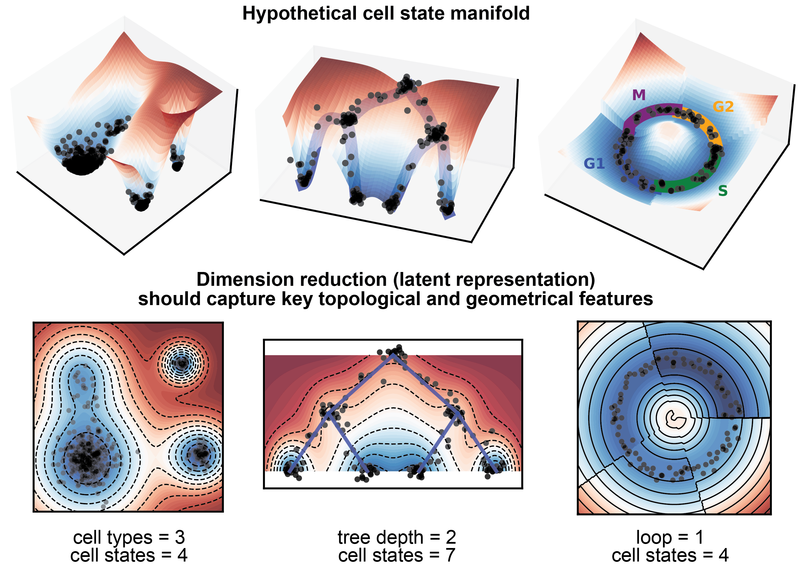
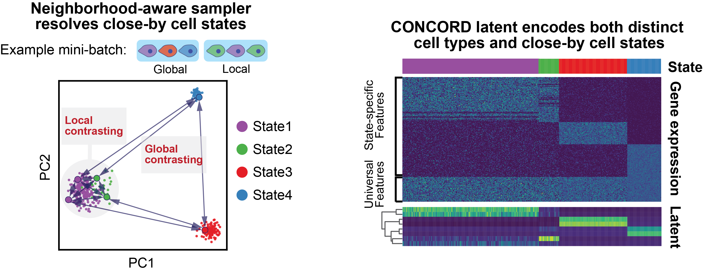
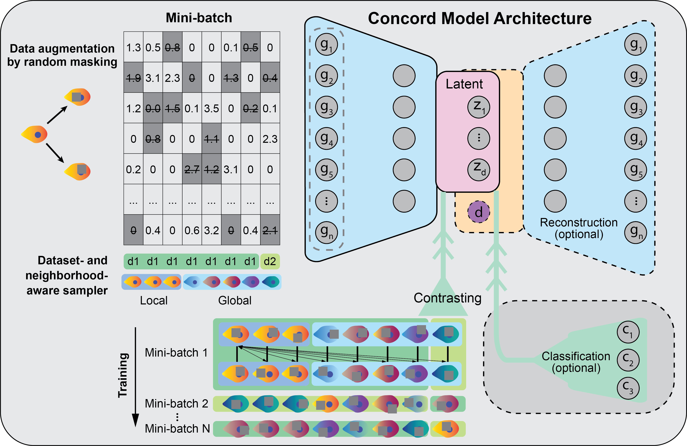

# The CONCORD Framework

## What Does CONCORD Do?

CONCORD tackles three central challenges in single-cell data analysis: dimensionality reduction, denoising, and data integration. Operating in a one-shot, fully unsupervised manner, it produces denoised cell embeddings that capture the essential topological and geometric features of the underlying biological manifold—revealing fine-grained local details while preserving a coherent global structure.

{width="60%"}

Beyond its core functionality, CONCORD supports additional tasks such as cell type classification (via label transfer), doublet calling, data projection, and annotation-guided latent representation. It also includes two key modules:

- **Simulation Module:** Generates various topologies—clusters, trajectories, trees, and loops—commonly observed in single-cell data, with customizable batch effects.

- **Benchmarking Module:** Provides comprehensive evaluation statistics, including topological and geometric assessments.

Moreover, CONCORD offers tools for creating publication-quality visualizations.

## What Makes CONCORD Powerful?

CONCORD introduces a novel contrastive learning framework designed to denoise and reveal the intricate structure of the cellular state manifold across one or multiple datasets. Its core innovation lies in its **probabilistic sampling framework**, which seamlessly integrates two strategies:

- **Neighborhood-Aware Sampling:**  
  Adapted from the kNN sampler, this approach enables the model to explore local regions in depth while maintaining a global perspective. Instead of uniformly sampling “easy negatives” from the overall distribution, CONCORD selectively draws “hard negatives” from nearby cells, capturing subtle distinctions among closely related cell states.

{width="70%"}

- **Dataset-Aware Sampling:**  
  This strategy addresses data integration by contrasting cells within a single dataset at a time, rather than combining cells from multiple datasets in one mini-batch. By leveraging only the sampler and the contrastive objective, CONCORD effectively disentangles biological variation from dataset-specific artifacts—without the need for explicit batch-effect assumptions or adversarial training.

{width="100%"}

Together, these sampling strategies demonstrate that substantial improvements in contrastive learning can be achieved through principled sampling and training alone—without resorting to complex model architectures or additional loss terms. Unifying both approaches into a single probabilistic framework, CONCORD enhances embedding resolution while mitigating batch effects.

{width="100%"}

## Model Architecture

The current CONCORD model employs a minimalist design—a simple two-layer encoder with optional decoder and classifier heads. Notably, the probabilistic sampler is versatile and can be integrated with alternative architectures as well.

{width="70%"}
